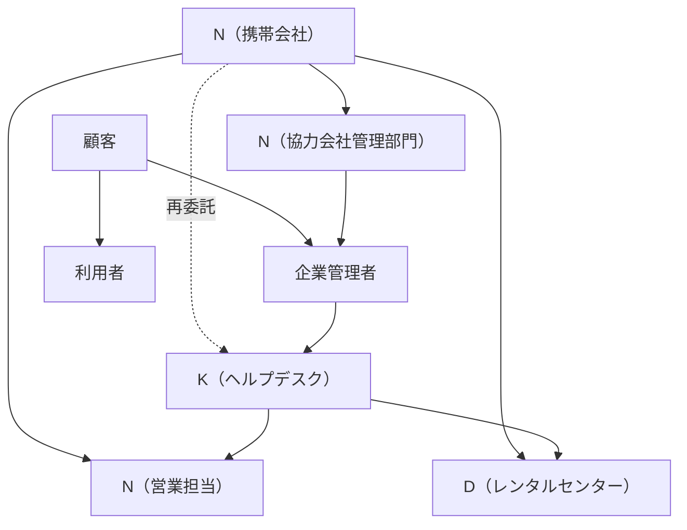
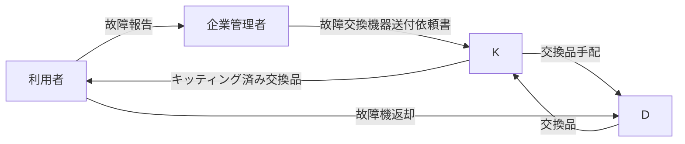
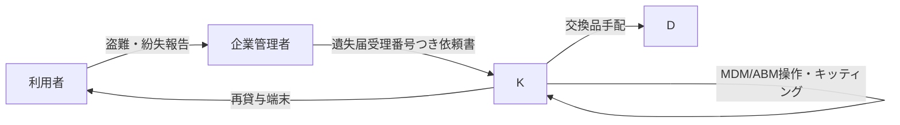
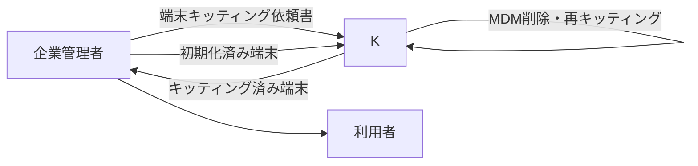
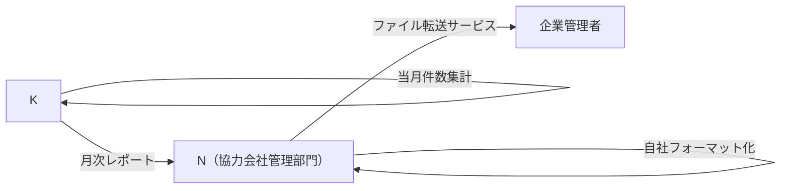

# 携帯管理サービス ハンドブック

## これは何か

このフォルダは、企業向けに貸与されたスマートフォンやタブレットを、故障・紛失・再設定・月次報告まで運用するための要件定義です。

やることはシンプルに見えます。壊れたら交換する。なくしたら再貸与する。使い回すならキッティングし直す。月末には件数を報告する。ただし現場では、依頼書Excel、受付管理簿、MDM、ABM、D（レンタルセンター）、K（ヘルプデスク）、N（営業担当）が絡むため、関係を固定しておかないとすぐ迷子になります。

このハンドブックは、PMや開発マネージャーが3分で全体像を掴むための入口です。

## 登場人物

企業の中に、端末を実際に使う「利用者」と、依頼をまとめる「企業管理者」がいます。企業管理者の相手をする実務窓口がK（ヘルプデスク）です。KはN（携帯会社）から再委託を受けた別法人で、依頼受付、台帳更新、キッティング、月次レポート作成を担います。

N（携帯会社）の中には、顧客の正式窓口であるN（営業担当）、月次報告を扱うN（協力会社管理部門）、端末物流を担うD（レンタルセンター）があります。DはN配下ですが、業務上は別組織として扱います。

## 4つの主要フロー

### 1. 故障対応

端末が壊れたら、利用者が企業管理者へ報告します。企業管理者は故障交換機器送付依頼書を作成し、Kへ送付します。Kは不備を確認し、Dへ交換品を手配し、届いた端末をキッティングして利用者へ送ります。交換後、故障機は初期化してDへ返却します。返却が遅れると未返却時賠償金の対象です。

### 2. 盗難紛失時の端末再貸与

端末をなくした場合は、警察への届出と遺失届受理番号が重要です。企業管理者は紛失時対応依頼書を作成し、Kへ送ります。KはDへ交換品を手配し、紛失機のMDMデバイス削除やABM所有状態解除を行い、交換品をキッティングして発送します。届出がない場合などは賠償金通知につながります。

### 3. リクエストキッティング

利用者変更や誤初期化で既存端末をもう一度セットアップする流れです。端末自体の交換はありません。企業管理者が端末キッティング依頼書を作り、対象端末を初期化してKへ送ります。KはMDMデバイス削除、KIT手順書に沿ったキッティング、返送を行います。このフローではD（レンタルセンター）は直接作業しません。

### 4. 月次レポート

Kは受付管理簿や受付システムから当月の故障、盗難紛失、リクエストキッティング、ヘルプデスク対応などを集計します。N（協力会社管理部門）が顧客向けフォーマットへ落とし込み、企業管理者へファイル転送サービスで送付します。PPAPは避けます。

## 略称早見表

| 略称 | 正式な扱い | 覚え方 |
|---|---|---|
| N（携帯会社） | 契約・サービス提供の親エンティティ | 全体の元請け |
| N（営業担当） | 顧客の正式窓口 | 相談とCCの相手 |
| N（協力会社管理部門） | 月次報告のN側担当 | Kのレポートを顧客向けに整える |
| D（レンタルセンター） | 端末物流・レンタル品管理 | 交換品を出し、返却を確認する |
| K（ヘルプデスク） | 再委託先の実務担当 | 受付、台帳、キッティングの中心 |
| 企業管理者 | 顧客側の管理担当 | 依頼書を書く人 |
| 利用者 | 端末を使う社員 | 故障・紛失の当事者 |

## 現場で使う道具

| 道具 | 使いどころ | 詳細 |
|---|---|---|
| 故障交換機器送付依頼書 | 故障交換を依頼する | `04-data-model.md` |
| 紛失時対応依頼書 | 盗難紛失時の再貸与を依頼する | `04-data-model.md` |
| 端末キッティング依頼書 | 既存端末の再キッティングを依頼する | `04-data-model.md` |
| 受付管理簿 | 受付日、発送日、伝票番号、完了日、端末情報を管理する | `04-data-model.md` |
| MDM | 端末の設定、アプリ、ロック、ワイプ、デバイス削除を扱う | `03-glossary.md` |
| ABM/ASM | Apple端末の組織割当や所有状態を扱う | `03-glossary.md` |
| ファイル転送サービス | 月次レポートの送付に使う | `08-flow-monthly-report.md` |

## 読み方案内

| 目的 | 読むファイル |
|---|---|
| 全体像を掴みたい | この `00-handbook.md`、次に `01-service-overview.md` |
| AIに実装させたい | `README.md` から順番に読む |
| 組織関係で迷った | `02-org-chart.md` |
| 用語の意味を確認したい | `03-glossary.md` |
| DBやフォーム項目を作りたい | `04-data-model.md` |
| フローごとの状態遷移を作りたい | `05-flow-breakdown.md` から `08-flow-monthly-report.md` |
| 例外処理を洗いたい | `09-edge-cases.md` |

## よくある疑問

### NとDは何が違う？

N（携帯会社）は親エンティティです。D（レンタルセンター）はN配下の端末物流・レンタル品管理組織です。同じグループでも、業務上は別組織として扱います。レンタルセンターをN名義で書くと混乱するため、必ずD（レンタルセンター）と書きます。

### Kは誰？

K（ヘルプデスク）は、Nから再委託を受けた別法人です。顧客から見ると実務窓口ですが、正式な営業窓口はN（営業担当）です。そのためKのメールではN（営業担当）をCCに入れる場面があります。

### なぜExcelが多い？

現場の受付・依頼・報告がExcelで運用されているためです。ただし代理店ごとに受付システムは異なり、Excel、kintone、Microsoft Power Appsなどへ差し替わる可能性があります。実装ではExcelそのものに固定せず、`04-data-model.md` の論理項目を中心に設計します。

### いちばん危ない例外は？

故障機の未返却、盗難紛失時の遺失届不足、ABM/ASM組織ID未記入です。これらは賠償金、作業停止、キッティング不能につながります。詳細は `09-edge-cases.md` に集約しています。
