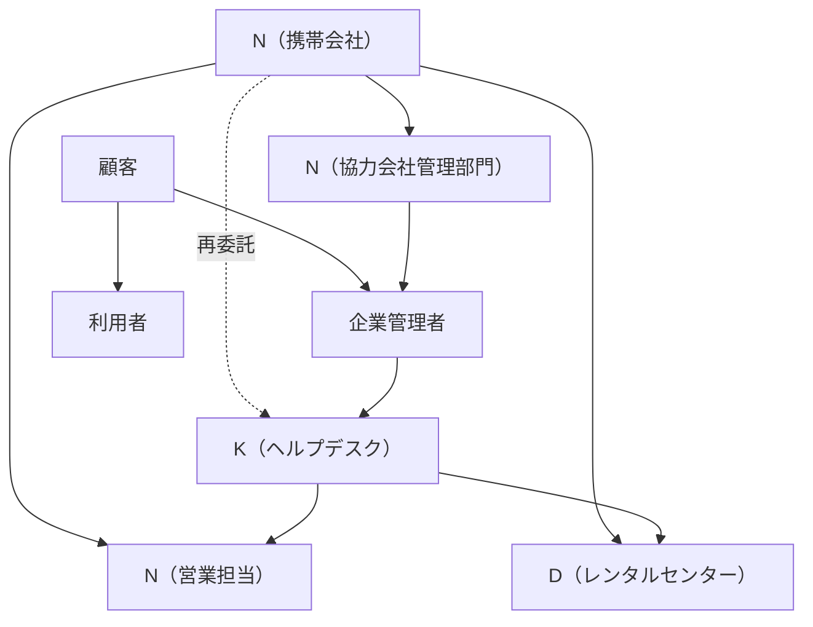

# 組織構造

## このファイルの位置づけ

`yoshida/` 配下の要件定義では、組織名と責務の定義はこのファイルを正とする。他ファイルで表記ゆれや古い呼称が見つかった場合は、このファイルの定義に合わせて読み替える。

出典:
- `_source/shared/service-catalog.pdf`
- `_source/shared/service-catalog.xlsx`
- `_source/01-breakdown/flow-diagram.pdf`
- `_source/02-lost-device/flow-diagram.pdf`
- `_source/03-request-kitting/flow-diagram.pdf`
- `_source/04-monthly-report/flow-diagram.pdf`

## 階層図

## エンティティ定義

| エンティティ | 種別 | 主な責務 | 備考 |
|---|---|---|---|
| N（携帯会社） | 親エンティティ | 法人向け端末レンタルサービスの契約主体。配下組織と再委託先を通じて顧客へサービスを提供する | 営業担当、協力会社管理部門、D（レンタルセンター）を含む親枠組み |
| N（営業担当） | N内の顧客窓口 | 新規端末導入、ソリューション提案、SIM/eSIM再発行相談、Kからの情報共有先 | 顧客にとっての正式窓口。Kからのメールでは原則CCに入る |
| N（協力会社管理部門） | N内の委託管理窓口 | Kから月次レポートを受領し、自社フォーマットへ落とし込んで企業管理者へ報告する | 月次レポートフローのN側実務担当 |
| D（レンタルセンター） | N配下の物流・端末管理組織 | 交換品の在庫管理、発送、故障機の受領、賠償金通知、端末返却確認 | Nと同じグループだが、業務上は別組織として扱う |
| K（ヘルプデスク） | 再委託先の別法人 | 依頼受付、不備確認、受付管理簿更新、交換品手配、キッティング、MDM/ABM操作代行、月次レポート作成 | 吉田さん所属。代理店・ヘルプデスクとして動く |
| 企業管理者 | 顧客側管理者 | 利用者からの報告受領、依頼書作成、社内処理、Kへの依頼、月次レポート受領 | 情報システム部・総務部などを想定 |
| 利用者 | 顧客側端末利用者 | 故障・盗難紛失の事案報告、端末受領、開通作業、データコピー | 実際に端末を業務利用する社員 |

## 関係

| 関係 | 説明 | 主な通信 |
|---|---|---|
| N（携帯会社） → K（ヘルプデスク） | 業務委託・再委託の関係。KはNの受託業務を実務として実施する | 月次報告、案件連携 |
| K（ヘルプデスク） → N（営業担当） | 顧客対応上の情報共有。Kは正式窓口であるN（営業担当）へCCで共有する | メールCC |
| K（ヘルプデスク） → D（レンタルセンター） | 交換品や再貸与端末の手配依頼。依頼書を添付してDへ送る | メール、依頼書Excel |
| D（レンタルセンター） → K（ヘルプデスク） | 交換品発送、賠償金通知、返却確認 | 宅配便、メール |
| 企業管理者 → K（ヘルプデスク） | 故障・紛失・リクエストキッティングの依頼窓口 | メール、依頼書Excel |
| 利用者 → 企業管理者 | 事案報告、受領報告 | 社内連絡 |
| N（協力会社管理部門） → 企業管理者 | 月次レポートの正式報告 | ファイル転送サービス、メール |

## フロー別登場エンティティ

| フロー | 利用者 | 企業管理者 | K（ヘルプデスク） | N（営業担当） | N（協力会社管理部門） | D（レンタルセンター） |
|---|---:|---:|---:|---:|---:|---:|
| 故障対応 | 参加 | 参加 | 参加 | 共有・相談 | - | 参加 |
| 盗難紛失時の端末再貸与 | 参加 | 参加 | 参加 | 共有・SIM/eSIM相談 | - | 参加 |
| リクエストキッティング | 参加 | 参加 | 参加 | 共有 | - | 直接作業なし |
| 月次レポート | - | 受領 | 作成・送付 | - | 受領・加工・報告 | - |

## 表記ルール

許可する組織表記は次の通り。

| 許可表記 | 用途 |
|---|---|
| N（携帯会社） | 親エンティティとしてのN |
| N（営業担当） | 顧客側の正式営業窓口 |
| N（協力会社管理部門） | 月次レポートのN側報告担当 |
| D（レンタルセンター） | 端末物流・レンタル品管理拠点 |
| K（ヘルプデスク） | 再委託先の代理店・ヘルプデスク |
| 企業管理者 | 顧客側の管理担当 |
| 利用者 | 端末利用者 |

禁止する考え方:
- レンタルセンターをN名義のレーンとして扱わない。必ず D（レンタルセンター）に統一する。
- 実在会社名、旧社名、支社名、代理店の法人名を要件定義に直書きしない。
- K（ヘルプデスク）をN内部組織として扱わない。KはNから再委託を受けた別法人として扱う。
- D（レンタルセンター）をリクエストキッティングの直接作業担当にしない。

