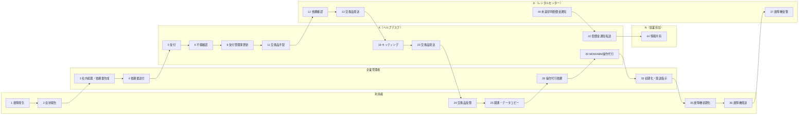

# 故障対応フロー

## 概要

| 項目 | 内容 |
|---|---|
| トリガー | 利用者の業務端末に故障が発生し、企業管理者へ報告される |
| 完了条件 | 交換品の発送・開通、MDM/ABM操作代行、故障機返却確認が完了する |
| 例外条件 | 依頼書不備、交換品初期不良、故障機未返却、初期化未実施 |
| 関係レーン | 利用者、企業管理者、K（ヘルプデスク）、N（営業担当）、D（レンタルセンター） |
| 主要データ | 故障交換機器送付依頼書、受付管理簿、MDM/ABM操作代行依頼、配送伝票 |

組織定義は `02-org-chart.md`、用語定義は `03-glossary.md`、データ項目は `04-data-model.md` を正とする。

## 登場エンティティ

| エンティティ | このフローでの役割 |
|---|---|
| 利用者 | 故障報告、交換品受領、開通作業、故障機初期化・返却 |
| 企業管理者 | 社内処理、依頼書作成、Kへの依頼、利用者への返却指示 |
| K（ヘルプデスク） | 受付、不備確認、受付管理簿更新、Dへの交換品手配、キッティング、発送、操作代行 |
| N（営業担当） | SIM/eSIM再発行相談先、未返却時賠償金発生時の情報共有先 |
| D（レンタルセンター） | 交換品発送、故障機受領・確認、未返却時賠償金通知 |

## スイムレーン図

## Phase別ステップ一覧

| Step | Phase | 実行者 | アクション | 注 | 通信手段 |
|---:|---|---|---|---|---|
| 1 | 故障発生から依頼書送付 | 利用者 | 事案発生 | - | - |
| 2 | 故障発生から依頼書送付 | 利用者 | 故障症状を企業管理者へ報告 | - | 社内連絡 |
| 3 | 故障発生から依頼書送付 | 企業管理者 | 社内処理、故障交換機器送付依頼書作成 | 注1 | Excel |
| 4 | 故障発生から依頼書送付 | 企業管理者 | Kへ依頼書送付 | - | メール |
| 5 | 受付から不備確認 | K（ヘルプデスク） | 受付 | - | メール |
| 6 | 受付から不備確認 | K（ヘルプデスク） | 依頼書不備確認 | - | Excel |
| 7 | 受付から不備確認 | 企業管理者 | 不備修正・再送 | - | メール |
| 8 | 受付管理簿から交換品手配 | K（ヘルプデスク） | 受付管理簿更新 | - | 台帳 |
| 9 | 受付管理簿から交換品手配 | K（ヘルプデスク） | 承り連絡 | - | メール |
| 10 | 受付管理簿から交換品手配 | 企業管理者 | 受付確認 | - | メール |
| 11 | 受付管理簿から交換品手配 | K（ヘルプデスク） | Dへ交換品手配 | - | メール |
| 12 | 受付管理簿から交換品手配 | D（レンタルセンター） | 依頼内容確認 | - | メール |
| 13 | 交換品準備から発送 | D（レンタルセンター） | 交換品をKへ発送 | - | 宅配便 |
| 14 | 交換品準備から発送 | K（ヘルプデスク） | 交換品受領 | - | 宅配便 |
| 15 | 交換品準備から発送 | K（ヘルプデスク） | テプラ、同梱物等を準備 | - | 手作業 |
| 16 | 交換品準備から発送 | K（ヘルプデスク） | キッティング稼働確保 | - | 社内調整 |
| 17 | 交換品準備から発送 | K（ヘルプデスク） | 手順書印刷、準備 | - | 手作業 |
| 18 | 交換品準備から発送 | K（ヘルプデスク） | キッティング実施 | 注2 | MDM/端末操作 |
| 19 | 交換品準備から発送 | K（ヘルプデスク） | 発送準備 | - | 手作業 |
| 20 | 交換品準備から発送 | K（ヘルプデスク） | 発送連絡 | - | メール |
| 21 | 交換品準備から発送 | 企業管理者 | 発送連絡確認 | - | メール |
| 22 | 交換品準備から発送 | K（ヘルプデスク） | 受付管理簿に発送日・伝票番号追記 | - | 台帳 |
| 23 | 交換品準備から発送 | K（ヘルプデスク） | 交換品発送 | - | 宅配便 |
| 24 | 受領から開通作業 | 利用者 | 交換品受領 | - | 宅配便 |
| 25 | 受領から開通作業 | 利用者 | 開通作業、必要に応じてデータコピー | - | 端末操作 |
| 26 | 操作代行から故障機返却 | 利用者 | 交換品受領連絡 | - | 社内連絡 |
| 27 | 操作代行から故障機返却 | 企業管理者 | 受領確認 | - | 社内連絡 |
| 28 | 操作代行から故障機返却 | 企業管理者 | MDM/ABM操作代行依頼 | - | メール |
| 29 | 操作代行から故障機返却 | K（ヘルプデスク） | 操作代行受付 | - | メール |
| 30 | 操作代行から故障機返却 | K（ヘルプデスク） | MDMデバイス削除、ABM所有状態解除 | - | MDM/ABM |
| 31 | 操作代行から故障機返却 | K（ヘルプデスク） | 作業完了報告 | - | メール |
| 32 | 操作代行から故障機返却 | 企業管理者 | 完了確認 | - | メール |
| 33 | 操作代行から故障機返却 | 企業管理者 | 利用者へ初期化・発送指示 | - | 社内連絡 |
| 34 | 操作代行から故障機返却 | 利用者 | 指示確認 | - | 社内連絡 |
| 35 | 操作代行から故障機返却 | 利用者 | 故障機初期化 | - | 端末操作 |
| 36 | 操作代行から故障機返却 | 利用者 | 故障機をDへ返却 | - | 宅配便 |
| 37 | 操作代行から故障機返却 | D（レンタルセンター） | 故障機受領 | - | 宅配便 |
| 38 | 操作代行から故障機返却 | D（レンタルセンター） | 故障機確認 | - | 検品 |
| 39 | 未返却対応 | D（レンタルセンター） | 未返却確認 | - | 台帳 |
| 40 | 未返却対応 | D（レンタルセンター） | 未返却時賠償金通知 | - | メール |
| 41 | 未返却対応 | K（ヘルプデスク） | 通知確認 | - | メール |
| 42 | 未返却対応 | K（ヘルプデスク） | 企業管理者へ転送 | - | メール |
| 43 | 未返却対応 | 企業管理者 | 通知受領 | - | メール |
| 44 | 未返却対応 | N（営業担当） | 情報共有を受ける | - | メールCC |

## 詳細

### Phase 1: 故障発生から依頼書送付

利用者は故障内容、機種、色、製造番号、容量、利用電話番号、故障状態、故障内容を企業管理者へ報告する。企業管理者は社内承認や予備機払い出しなど企業内手続きを行い、`04-data-model.md` の「故障交換機器送付依頼書」に従って申込日、契約者情報、交換機器送付先、故障レンタル端末情報、ポイント利用、キッティング情報を入力する。

SIMカードまたはeSIMの再発行は、この依頼書ではなくN（営業担当）への相談事項とする。交換機器送付先は、交換品手配とキッティングを実施するK（ヘルプデスク）の拠点情報を入れる。

### Phase 2: 受付から不備確認

K（ヘルプデスク）は依頼書を受領し、記入漏れ、契約名義、機種、製造番号、送付先、ABM/ASM組織IDの必要有無を確認する。不備があれば企業管理者へ差し戻し、修正後に再確認する。不備がなければ受付管理簿へ進む。

### Phase 3: 受付管理簿から交換品手配

K（ヘルプデスク）は受付管理簿または受付システムに、項番、受付日、携帯電話番号、受付区分、対象端末機種、対象端末製造番号、申告内容・症状を記録する。承り連絡は誤送信防止のため依頼元メールへ全返信し、必要に応じて別担当者と宛先・本文を読み合わせる。

交換品手配では、KからD（レンタルセンター）へ故障交換機器送付依頼書を添付して送付する。

### Phase 4: 交換品準備から発送

D（レンタルセンター）は同一機種同一色を原則に交換品をKへ発送する。ただし在庫状況によりDが同等と判断した機種になる場合があり、交換品は未使用品に限らずクリーニング・初期化済み端末も含まれる。

K（ヘルプデスク）は交換品受領後、管理番号ラベル貼付、同梱物印刷、キッティング稼働確保、手順書印刷、作業者・確認者のアサイン、キッティング、発送準備を行う。交換品の機種名と製造番号は受付管理簿へ追記する。交換品初期不良があればKが再手配し、顧客へ連絡する。

### Phase 5: 受領から開通作業

利用者は交換品を受領し、必要に応じてデータコピーを行う。物理SIMの場合は旧端末からSIMカードを取り出し交換品へ挿入する。eSIMの場合はプロファイルダウンロードで開通する。故障機が画面割れのみで利用継続中の場合、交換品到着前にeSIMを開通すると旧端末の通信が使えなくなるため、開通タイミングを分ける。

### Phase 6: 操作代行から故障機返却

企業管理者は交換品受領後、故障交換機器送付依頼書を添付してKへMDM/ABM操作代行を依頼する。KはMDM上の故障端末をデバイス削除し、ABM/ASM対象端末では所有状態解除を行う。デバイス削除は、故障機初期化のブロック回避、不要ライセンス削減、MDM上の不要データ削減のために必要である。

操作代行完了後、企業管理者は利用者へ故障機初期化と返却を指示する。利用者は個人情報やMDM情報を含む全情報を消去し、iOS端末では「iPhoneを探す」をオフにする。故障機は本体のみを返却し、UIMカード、SDカード、アクセサリ類は取り外す。返却期限は交換機器受領後2週間以内。

### Phase 7: 未返却対応

故障機が期限内に返却されない、または初期化されず返却された場合、D（レンタルセンター）から未返却時賠償金通知が発生する。Kは通知を確認して企業管理者へ転送し、N（営業担当）をCCで情報共有する。詳細な扱いは `09-edge-cases.md` に集約する。

## 例外分岐

| 例外 | 分岐 | 参照 |
|---|---|---|
| 依頼書不備 | Kが企業管理者へ差し戻し、修正後に再受付 | `04-data-model.md` |
| 交換品初期不良 | Kが交換品を再手配し、顧客へ連絡 | `09-edge-cases.md` |
| 故障機未返却 | Dから賠償金通知、Kが転送、N（営業担当）へ共有 | `09-edge-cases.md` |
| 初期化未実施 | 未返却時賠償金請求の対象 | `09-edge-cases.md` |

## 注記

| 注 | 内容 |
|---|---|
| 注1 | SIMカード/eSIM再発行はN（営業担当）へ相談する |
| 注2 | 交換品の初期不良時はK（ヘルプデスク）が再手配し、顧客へ連絡する |

## 出典

- `_source/01-breakdown/flow.md`
- `_source/01-breakdown/flow-detail.docx`
- `_source/01-breakdown/flow-diagram.pdf`
- `_source/01-breakdown/request-form.xlsx`
- `_source/shared/reception-ledger.pdf`
- `_source/shared/reception-ledger.xlsx`

