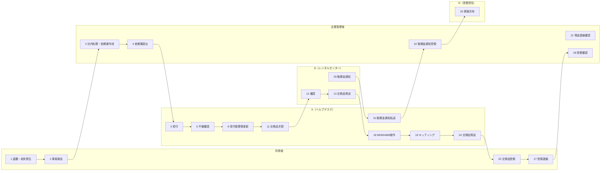

# 盗難紛失時の端末再貸与フロー

## 概要

| 項目 | 内容 |
|---|---|
| トリガー | 利用者の業務端末に盗難または紛失が発生し、企業管理者へ報告される |
| 完了条件 | 交換品の再貸与、キッティング、発送、受領確認が完了する |
| 例外条件 | 遺失届未提出、海外紛失、社内紛失、依頼書不備、交換品初期不良、賠償金通知 |
| 関係レーン | 利用者、企業管理者、K（ヘルプデスク）、N（営業担当）、D（レンタルセンター） |
| 主要データ | 紛失時対応依頼書、遺失届受理番号、受付管理簿、配送伝票 |

組織定義は `02-org-chart.md`、用語定義は `03-glossary.md`、データ項目は `04-data-model.md` を正とする。

## 登場エンティティ

| エンティティ | このフローでの役割 |
|---|---|
| 利用者 | 盗難・紛失報告、交換品受領、必要に応じたデータコピー |
| 企業管理者 | 社内処理、警察届出情報確認、依頼書作成、Kへの依頼、受領確認 |
| K（ヘルプデスク） | 受付、不備確認、受付管理簿更新、Dへの交換品手配、MDM/ABM操作、キッティング、発送、賠償金通知転送 |
| N（営業担当） | SIM/eSIM再発行相談先、賠償金発生時の情報共有先 |
| D（レンタルセンター） | 交換品発送、条件該当時の賠償金通知 |

## スイムレーン図

## Phase別ステップ一覧

| Step | Phase | 実行者 | アクション | 注 | 通信手段 |
|---:|---|---|---|---|---|
| 1 | 事案発生から依頼書提出 | 利用者 | 盗難・紛失発生 | - | - |
| 2 | 事案発生から依頼書提出 | 利用者 | 企業管理者へ事案報告 | - | 社内連絡 |
| 3 | 事案発生から依頼書提出 | 企業管理者 | 社内処理、紛失時対応依頼書作成 | 注1 | Excel |
| 4 | 事案発生から依頼書提出 | 企業管理者 | Kへ依頼書提出 | - | メール |
| 5 | 受付から不備確認 | K（ヘルプデスク） | 受付 | - | メール |
| 6 | 受付から不備確認 | K（ヘルプデスク） | 依頼書不備確認 | - | Excel |
| 7 | 受付から不備確認 | 企業管理者 | 不備修正・再送 | - | メール |
| 8 | 受付管理簿から交換品手配 | K（ヘルプデスク） | 受付管理簿更新 | - | 台帳 |
| 9 | 受付管理簿から交換品手配 | K（ヘルプデスク） | 承り連絡 | - | メール |
| 10 | 受付管理簿から交換品手配 | 企業管理者 | 受付確認 | - | メール |
| 11 | 受付管理簿から交換品手配 | K（ヘルプデスク） | Dへ交換品手配 | - | メール |
| 12 | 受付管理簿から交換品手配 | D（レンタルセンター） | 依頼内容確認 | - | メール |
| 13 | 交換品準備からキッティング | D（レンタルセンター） | 交換品をKへ発送 | - | 宅配便 |
| 14 | 交換品準備からキッティング | K（ヘルプデスク） | 交換品受領 | - | 宅配便 |
| 15 | 交換品準備からキッティング | K（ヘルプデスク） | テプラ、同梱物等を準備 | - | 手作業 |
| 16 | 交換品準備からキッティング | K（ヘルプデスク） | キッティング稼働確保 | - | 社内調整 |
| 17 | 交換品準備からキッティング | K（ヘルプデスク） | 手順書印刷、準備 | - | 手作業 |
| 18 | 交換品準備からキッティング | K（ヘルプデスク） | 紛失機のMDMデバイス削除、ABM所有状態解除 | - | MDM/ABM |
| 19 | 交換品準備からキッティング | K（ヘルプデスク） | 交換品キッティング | 注2 | MDM/端末操作 |
| 20 | 発送から利用者受領 | K（ヘルプデスク） | 交換品発送準備 | - | 手作業 |
| 21 | 発送から利用者受領 | K（ヘルプデスク） | 発送連絡 | - | メール |
| 22 | 発送から利用者受領 | 企業管理者 | 発送連絡確認 | - | メール |
| 23 | 発送から利用者受領 | K（ヘルプデスク） | 受付管理簿更新 | - | 台帳 |
| 24 | 発送から利用者受領 | K（ヘルプデスク） | 交換品発送 | - | 宅配便 |
| 25 | 発送から利用者受領 | 利用者 | 交換品受領 | - | 宅配便 |
| 26 | 発送から利用者受領 | 利用者 | 必要に応じてデータコピー | - | 端末操作 |
| 27 | 発送から利用者受領 | 利用者 | 企業管理者へ受領連絡 | - | 社内連絡 |
| 28 | 発送から利用者受領 | 企業管理者 | 受領確認 | - | 社内連絡 |
| 29 | 賠償金通知 | D（レンタルセンター） | 賠償金通知 | 注3 | メール |
| 30 | 賠償金通知 | K（ヘルプデスク） | 通知確認 | 注4 | メール |
| 31 | 賠償金通知 | K（ヘルプデスク） | 企業管理者へ転送 | - | メール |
| 32 | 賠償金通知 | 企業管理者 | 通知受領 | - | メール |
| 33 | 賠償金通知 | N（営業担当） | 情報共有を受ける | - | メールCC |

## 詳細

### Phase 1: 事案発生から依頼書提出

利用者は盗難・紛失の経緯、場所、時期、端末機種、色、製造番号、容量、利用電話番号、UIMカード/eSIMの所在を企業管理者へ報告する。企業管理者は社内処理を行い、警察への届出と遺失届受理番号を確認したうえで、`04-data-model.md` の「紛失時対応依頼書」を作成する。

オンラインで遺失届を申請した場合は警察署名の記載を省略できる。海外紛失では渡航履歴が分かる資料を添付する。社内紛失などで遺失届を取得できない場合は、受理番号が発行されない理由を記載した会社印押印済みの経緯書が必要になる。

SIMカード/eSIMの再発行相談はN（営業担当）へ行う。

### Phase 2: 受付から不備確認

K（ヘルプデスク）は依頼書を受領し、記入漏れ、契約名義、機種、製造番号、送付先、ABM/ASM組織ID、遺失届受理番号、海外紛失時の添付資料を確認する。不備があれば企業管理者へ差し戻し、修正後に再確認する。

### Phase 3: 受付管理簿から交換品手配

Kは受付管理簿または受付システムに、項番、受付日、携帯電話番号、受付区分、対象端末機種、対象端末製造番号を記録する。紛失では申告内容・症状は原則記載不要。承り連絡は依頼元メールへ全返信する。

交換品手配では、KからD（レンタルセンター）へ紛失時対応依頼書を添付して送付する。

### Phase 4: 交換品準備からキッティング

D（レンタルセンター）は交換品をKへ発送する。Kは交換品受領後、テプラ貼付、同梱物準備、キッティング稼働確保、手順書印刷を行う。

盗難・紛失機に対しては、MDM上のデバイス削除を実施する。ABM/ASM対象のiPhone/iPadでは所有状態解除も行う。削除の目的は、不要ライセンス費用の抑制、MDM上の不要データ削減、予期せぬエラー防止である。

交換品はキッティング後に発送する。eSIM端末はキッティング時にプロファイルダウンロードまで実施し、物理SIM端末はSIMカード再発行済みの状態で発送する。

### Phase 5: 発送から利用者受領

Kは発送準備後、企業管理者へ発送連絡を行い、受付管理簿に発送日、伝票番号、交換品機種名、交換品製造番号を追記する。交換品は利用者または企業管理者経由で発送する。利用者は受領後、紛失端末が後から見つかった場合のみ必要に応じてデータコピーを行う。

### Phase 6: 賠償金通知

警察署への届出がないなど所定条件を満たさない場合、D（レンタルセンター）からKへ賠償金通知が届く。Kは企業管理者へ転送し、N（営業担当）へCCで共有する。詳細な扱いは `09-edge-cases.md` に集約する。

## 例外分岐

| 例外 | 分岐 | 参照 |
|---|---|---|
| 依頼書不備 | Kが企業管理者へ差し戻し、修正後に再受付 | `04-data-model.md` |
| 遺失届受理番号なし | 受付不可または経緯書提出へ分岐 | `09-edge-cases.md` |
| 海外紛失 | 渡航履歴資料を依頼書に添付 | `09-edge-cases.md` |
| 社内紛失 | 会社印押印済み経緯書を提出 | `09-edge-cases.md` |
| 交換品初期不良 | Kが交換品を再手配し、顧客へ連絡 | `09-edge-cases.md` |
| 賠償金通知 | Dから通知、Kが転送、N（営業担当）へ共有 | `09-edge-cases.md` |

## 注記

| 注 | 内容 |
|---|---|
| 注1 | 依頼時には遺失届受理番号が必要。SIMカード/eSIM再発行はN（営業担当）へ相談する |
| 注2 | 交換品の初期不良時はK（ヘルプデスク）が再手配し、顧客へ連絡する |
| 注3 | 警察署へ盗難・紛失届を行っていない場合などに賠償金通知が発生する |
| 注4 | D（レンタルセンター）から通知連絡がある |

## 出典

- `_source/02-lost-device/flow.md`
- `_source/02-lost-device/flow-detail.docx`
- `_source/02-lost-device/flow-diagram.pdf`
- `_source/02-lost-device/request-form.xlsx`
- `_source/shared/reception-ledger.pdf`
- `_source/shared/reception-ledger.xlsx`

