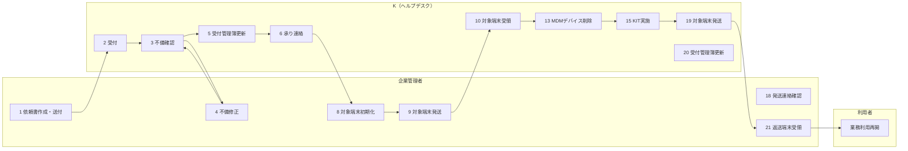

# リクエストキッティング対応フロー

## 概要

| 項目 | 内容 |
|---|---|
| トリガー | 利用者変更、誤初期化、再設定などにより既存端末の再キッティングが必要になる |
| 完了条件 | 対象端末がKでキッティングされ、企業管理者へ返送・受領される |
| 例外条件 | 依頼書不備、対象端末未初期化、物理SIM同梱漏れ、返送先不備 |
| 関係レーン | 利用者、企業管理者、K（ヘルプデスク）、N（営業担当） |
| 主要データ | 端末キッティング依頼書、受付管理簿、配送伝票 |

組織定義は `02-org-chart.md`、用語定義は `03-glossary.md`、データ項目は `04-data-model.md` を正とする。D（レンタルセンター）は組織図上のN配下組織だが、このフローでは直接作業担当にならない。

## 登場エンティティ

| エンティティ | このフローでの役割 |
|---|---|
| 利用者 | 対象端末の利用者。受領後に業務利用を再開する |
| 企業管理者 | 依頼書作成、対象端末初期化、Kへの発送、返送端末受領、利用者への引き渡し |
| K（ヘルプデスク） | 受付、不備確認、受付管理簿更新、対象端末受領、MDMデバイス削除、キッティング、返送 |
| N（営業担当） | 直接作業はないが、顧客にとっての正式窓口として情報共有先になる |

## スイムレーン図

## Phase別ステップ一覧

| Step | Phase | 実行者 | アクション | 注 | 通信手段 |
|---:|---|---|---|---|---|
| 1 | 依頼書作成から受付 | 企業管理者 | 端末キッティング依頼書の作成・送付 | 注1 | メール、Excel |
| 2 | 依頼書作成から受付 | K（ヘルプデスク） | 受付 | - | メール |
| 3 | 依頼書作成から受付 | K（ヘルプデスク） | 不備確認 | - | Excel |
| 4 | 依頼書作成から受付 | 企業管理者 | 不備修正・再送 | - | メール |
| 5 | 受付管理簿から承り連絡 | K（ヘルプデスク） | 受付管理簿更新 | - | 台帳 |
| 6 | 受付管理簿から承り連絡 | K（ヘルプデスク） | 承り連絡、初期化・発送案内 | - | メール |
| 7 | 受付管理簿から承り連絡 | 企業管理者 | 承り連絡確認 | - | メール |
| 8 | 初期化・発送から受領 | 企業管理者 | 対象端末初期化 | - | 端末操作 |
| 9 | 初期化・発送から受領 | 企業管理者 | 対象端末をKへ発送 | 注2 | 宅配便 |
| 10 | 初期化・発送から受領 | K（ヘルプデスク） | 対象端末受領、依頼書照合 | - | 宅配便 |
| 11 | キッティング作業から返送 | K（ヘルプデスク） | 対象端末準備 | - | 手作業 |
| 12 | キッティング作業から返送 | K（ヘルプデスク） | キッティング稼働確保 | - | 社内調整 |
| 13 | キッティング作業から返送 | K（ヘルプデスク） | MDMデバイス削除 | - | MDM |
| 14 | キッティング作業から返送 | K（ヘルプデスク） | KIT手順書印刷・準備 | - | 手作業 |
| 15 | キッティング作業から返送 | K（ヘルプデスク） | KIT実施 | - | MDM/端末操作 |
| 16 | キッティング作業から返送 | K（ヘルプデスク） | 発送準備 | - | 手作業 |
| 17 | キッティング作業から返送 | K（ヘルプデスク） | 発送連絡 | - | メール |
| 18 | キッティング作業から返送 | 企業管理者 | 発送連絡確認 | - | メール |
| 19 | キッティング作業から返送 | K（ヘルプデスク） | 対象端末発送 | - | 宅配便 |
| 20 | キッティング作業から返送 | K（ヘルプデスク） | 受付管理簿更新、クローズ | - | 台帳 |
| 21 | キッティング作業から返送 | 企業管理者 | キッティング済み端末受領 | - | 宅配便 |

## 詳細

### Phase 1: 依頼書作成から受付

企業管理者は `04-data-model.md` の「端末キッティング依頼書」に従い、申告日、契約者名、部署名、依頼者、電子メール、連絡先、依頼種別、電話番号、機種名、キッティング情報、返送先を入力する。依頼種別は利用者変更または再キッティングを想定する。

K（ヘルプデスク）は依頼書を受領し、記入漏れ、契約名義、機種、返送先、電話番号を確認する。不備がある場合は企業管理者へ差し戻す。

### Phase 2: 受付管理簿から承り連絡

Kは受付管理簿または受付システムに、項番、受付日、携帯電話番号、受付区分、対象端末機種、対象端末製造番号を記録する。リクエストキッティングでは申告内容・症状は原則記載不要。

承り連絡では受付完了に加えて、対象端末の初期化、依頼書同封、物理SIM同梱条件、送料負担を企業管理者へ案内する。

### Phase 3: 初期化・発送から受領

企業管理者は対象端末を工場出荷状態に初期化する。初期化できない場合は手動削除可能なデータを削除してから発送する。送付物は端末キッティング依頼書、対象端末、物理SIM利用時のSIMカードである。端末送付時の送料等は顧客負担。

Kは受領後、端末キッティング依頼書と実端末を照合する。

### Phase 4: キッティング作業から返送

Kは対象端末準備、管理番号ラベル貼付、同梱物準備、稼働確保、MDMデバイス削除、KIT手順書印刷、KIT実施、発送準備を行う。対象端末が未初期化の場合、Kが初期化することがあるが、データ復元はできない。eSIM端末ではプロファイルダウンロードをキッティング時に実施する。

発送連絡は承り連絡メールへ全返信し、伝票番号を含める。発送後、Kは受付管理簿に発送日、伝票番号、完了日を記録してクローズする。

## 例外分岐

| 例外 | 分岐 | 参照 |
|---|---|---|
| 依頼書不備 | Kが企業管理者へ差し戻し、修正後に再受付 | `04-data-model.md` |
| 対象端末未初期化 | Kが初期化する場合あり。データ復元不可 | `09-edge-cases.md` |
| 物理SIM同梱漏れ | 企業管理者へ確認し、追加送付または作業保留 | `09-edge-cases.md` |
| 返送先不備 | Kが企業管理者へ確認し、発送前に修正 | `04-data-model.md` |

## 注記

| 注 | 内容 |
|---|---|
| 注1 | キッティング対象端末がある場合は、端末キッティング依頼書を作成してKへ送付する |
| 注2 | 端末キッティング依頼書を同封する。SIM送付は物理SIMの場合のみ。端末送付時の送料等は顧客負担 |

## 出典

- `_source/03-request-kitting/flow.md`
- `_source/03-request-kitting/flow-detail.docx`
- `_source/03-request-kitting/flow-diagram.pdf`
- `_source/03-request-kitting/request-form.xlsx`
- `_source/shared/reception-ledger.pdf`
- `_source/shared/reception-ledger.xlsx`

