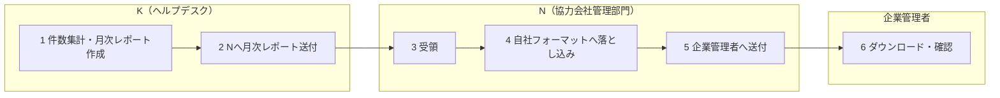

# 月次レポート対応フロー

## 概要

| 項目 | 内容 |
|---|---|
| トリガー | 月次締め後、当月のヘルプデスク等の対応実績を報告する |
| 完了条件 | 企業管理者がファイル転送サービスから月次レポートをダウンロードできる |
| 例外条件 | 報告先情報の変更、ファイル転送サービスへのアクセス不可、閲覧不可、報告フォーマット差異 |
| 関係レーン | K（ヘルプデスク）、N（協力会社管理部門）、企業管理者 |
| 主要データ | 受付管理簿、受付システム、月次レポート、お客様情報シート、折衝記録 |

組織定義は `02-org-chart.md`、用語定義は `03-glossary.md`、データ項目は `04-data-model.md` を正とする。

## 登場エンティティ

| エンティティ | このフローでの役割 |
|---|---|
| K（ヘルプデスク） | 当月実績の集計、月次レポート作成、N（協力会社管理部門）への送付 |
| N（協力会社管理部門） | Kのレポートを受領し、自社フォーマットへ落とし込んで企業管理者へ送付 |
| 企業管理者 | 月次レポートの最終受領者。ファイル転送サービスからダウンロードして確認する |

## スイムレーン図

## Phase別ステップ一覧

| Step | Phase | 実行者 | アクション | 注 | 通信手段 |
|---:|---|---|---|---|---|
| 1 | 集計・作成から送付 | K（ヘルプデスク） | 当月実績を集計し月次レポートを作成 | - | 受付管理簿、受付システム |
| 2 | 集計・作成から送付 | K（ヘルプデスク） | N（協力会社管理部門）へ月次レポート送付 | - | ファイル転送サービス、メール |
| 3 | 集計・作成から送付 | N（協力会社管理部門） | 月次レポート受領 | - | ファイル転送サービス、メール |
| 4 | フォーマット化から報告 | N（協力会社管理部門） | 自社フォーマットへ落とし込み | - | 報告フォーマット |
| 5 | フォーマット化から報告 | N（協力会社管理部門） | 企業管理者へ月次レポート送付 | - | ファイル転送サービス、メール |
| 6 | フォーマット化から報告 | 企業管理者 | 月次レポートをダウンロード | - | ファイル転送サービス |

## 詳細

### Phase 1: 集計・作成から送付

K（ヘルプデスク）は受付管理簿または受付システムから、当月の故障対応、盗難紛失時の端末再貸与、リクエストキッティングを集計する。受付システムは代理店ごとにExcel、kintone、Microsoft Power Apps等があり、実装差を前提にする。

月次レポートには、`04-data-model.md` の「月次レポートスキーマ」に従って、故障対応件数、盗難紛失時の端末再貸与件数、利用者変更件数、再キッティング件数、当月キッティング対応件数合計、契約期間内上限、翌月以降残件数を記載する。

業務委託契約にヘルプデスク対応が含まれる場合は、問い合わせ件数と折衝記録を添付する。24時間365日の盗難紛失サポートが含まれる場合は、遠隔ロック、遠隔初期化、発見時対応、パスワードリセット等の件数を記載する。これらは上限管理の対象外または別上限になる場合がある。

Kは作成した月次レポートをN（協力会社管理部門）へ送付する。報告書送付先はサービスカタログの「お客様情報」シートを参照する。

### Phase 2: フォーマット化から報告

N（協力会社管理部門）はKから受領した月次レポートを確認し、顧客向けの自社フォーマットに落とし込む。原本の詳細手順では、K作成レポートを画面キャプチャで貼付する例が示されている。フォーマットは顧客・案件ごとに差し替わる。

N（協力会社管理部門）はファイル転送サービスを利用して企業管理者へ月次レポートを送付する。PPAPは情報セキュリティ上避ける。利用可能なファイル転送サービスは企業ごとに異なり、Box、Dropbox、STORM、eTransporter、クリプト便、Smooth File、GigaFile便等の選択肢がある。

企業管理者はファイル転送サービスから月次レポートをダウンロードし、内容を確認する。アクセス不可やファイル閲覧不可が発生した場合は、N（協力会社管理部門）へ連絡する。

## 月次レポート記載例

| 業務内容 | 対応件数 |
|---|---:|
| 故障対応 | 3件 |
| 盗難紛失時の端末再貸与 | 0件 |
| 利用者変更 | 1件 |
| 再キッティング | 1件 |
| 当月のキッティング対応件数合計 | 5件 |
| 契約期間内のキッティング対応件数上限 | 100件/36か月 |
| 翌月以降のキッティング対応件数上限 | 95件/36か月 |
| 盗難紛失一次対応（遠隔ロック、遠隔初期化） | 0件 |
| 発見時対応（遠隔ロック解除、パスワードリセット） | 0件 |
| 当月のヘルプデスク対応件数 | 5件 |
| 契約期間内のヘルプデスク対応件数上限 | 50件/36か月 |
| 翌月以降のヘルプデスク対応件数上限 | 45件/36か月 |

## 例外分岐

| 例外 | 分岐 | 参照 |
|---|---|---|
| 受付システム差異 | 論理項目を `04-data-model.md` に合わせてマッピング | `04-data-model.md` |
| 報告先情報変更 | 営業担当者へ速やかに情報提供し、お客様情報シートを更新 | `04-data-model.md` |
| ファイル転送サービスアクセス不可 | 企業管理者がN（協力会社管理部門）へ連絡 | `03-glossary.md` |
| 報告フォーマット差異 | N（協力会社管理部門）が顧客向けフォーマットへ変換 | `04-data-model.md` |

## 出典

- `_source/04-monthly-report/flow.md`
- `_source/04-monthly-report/flow-detail.docx`
- `_source/04-monthly-report/flow-detail.pdf`
- `_source/04-monthly-report/flow-diagram.pdf`
- `_source/shared/service-catalog.pdf`
- `_source/shared/service-catalog.xlsx`
- `_source/shared/reception-ledger.pdf`
- `_source/shared/reception-ledger.xlsx`

